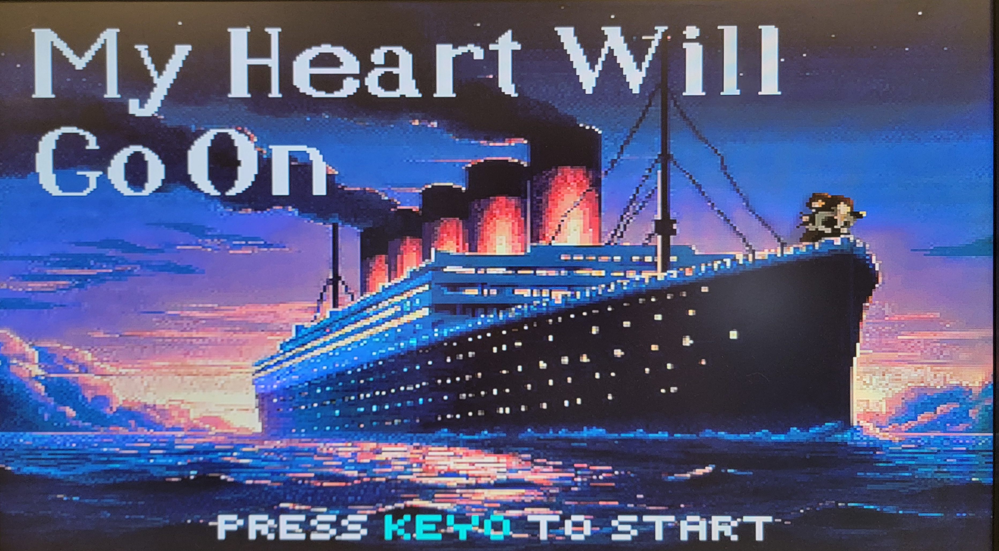

# ECE243 Final Project: FPGA Karaoke System

This project is an FPGA-based karaoke system that allows users to sing along to Celine Dion's "My Heart Will Go On." The program is written in C and runs on a Nios II soft-core processor implemented on the FPGA.

The system plays an instrumental track, displays synchronized lyrics and reference pitch information on a VGA display, analyzes the user's vocal input in real time, and calculates a score based on how closely the user's detected pitch matches the reference vocals.

## Features

* **Song Playback:** Plays the instrumental version of "My Heart Will Go On" for the user to sing along with.

* **Reference Pitch Extraction:** Uses the YIN pitch detection algorithm to extract pitch information from an isolated track of Celine Dion's vocals. The extracted pitch values are preprocessed and scaled to the VGA display dimensions ahead of time.

* **Real-Time Pitch Visualization:** Displays the reference pitch contour on the VGA screen and animates it as the song progresses, allowing the user to visually follow the target melody.

* **Voice Input Analysis:** Captures and analyzes the user's vocal input in real time using the Zero-Crossing Rate (ZCR) method. Although YIN provides more robust pitch estimation, it is too computationally expensive for real-time execution on the Nios II processor. ZCR is therefore used for live vocal input to reduce computational overhead and maintain real-time responsiveness.

* **Pitch Comparison and Scoring:** Compares the user's detected pitch against the reference pitch and calculates a score based on how closely they match. The current score is displayed throughout the performance, with the final score shown on the results screen.

* **Synchronized Lyrics:** Displays lyrics synchronized with the song throughout the performance.

* **Button Controls:** Uses the push buttons on the FPGA board to control the system:

  * `KEY0` starts the karaoke session.
  * `KEY3` restarts the program.

* **HEX Display Feedback:** Uses the FPGA board's seven-segment HEX displays to provide additional feedback based on how closely the user's detected pitch matches the reference pitch.

## Demo

https://youtu.be/x1BUx8fDzpE

## Usage

1. Ensure that the FPGA hardware is properly connected and configured.
2. Load and run the program on the Nios II processor.
3. Press `KEY0` to start the karaoke session.
4. Sing along with the instrumental track while following the lyrics and reference pitch visualization.
5. Match the reference pitch as closely as possible to achieve a higher score.
6. View the final score on the results screen after the song ends.
7. Press `KEY3` to restart the program.

## Acknowledgments

The implementation of the YIN pitch detection algorithm was based on the [YIN algorithm paper](http://audition.ens.fr/adc/pdf/2002_JASA_YIN.pdf) and the [ashokfernandez/Yin-Pitch-Tracking](https://github.com/ashokfernandez/Yin-Pitch-Tracking/tree/master) repository.
